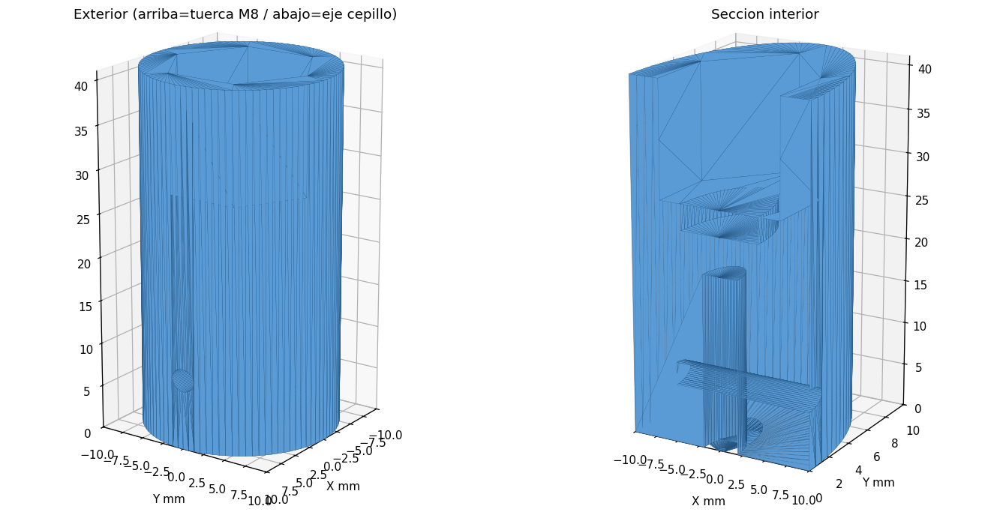

# Dremel casero 🛠️

Adaptador impreso en 3D para convertir un **motor DC 12 V (XD-3420)** en una
herramienta rotativa para **pulir piezas impresas en PLA**.

La pieza conecta la **punta roscada M8** del motor con un **cepillo de pulido de eje
Ø3,7 mm**, usando una **tuerca M8 cautiva** (rosca de acero, no de plástico) y un
**prisionero con inserto M2** para fijar el cepillo.

---

## Inicio rápido

1. **Imprime** `adaptador_motor_cepillo.stl` — de pie (eje vertical), sin soportes,
   PLA, 3–4 perímetros, 40–60 % de relleno.
2. **Mete la tuerca M8** a presión en el hueco hexagonal.
3. **Enrosca** el adaptador en la punta M8 del motor.
4. **Instala el inserto M2** de latón (calentar y empujar) en el taladro lateral.
5. **Mete el eje del cepillo** y fíjalo con el **tornillo M2×4**.

> ⚠️ Que el motor gire en el sentido que *aprieta* el adaptador (rosca a derechas).
> El PLA reblandece >60 °C: pulir a tirones, sin forzar (o imprimir en PETG).

---

## Necesitas

- Motor XD-3420 (12 V) con punta roscada M8.
- Cepillo de pulido con eje Ø3,7 mm.
- 1–2× tuerca M8 · 1× inserto M2 latón (OD 3,2×3) · 1× tornillo M2×4.

---

## Archivos

| Archivo | Qué es |
|---|---|
| `adaptador_motor_cepillo.stl` | Modelo listo para imprimir (versión actual) |
| `adaptador_motor_cepillo.scad` | Fuente paramétrica para **OpenSCAD** |
| `adaptador.py` / `build_manifold.py` | Fuentes paramétricas en Python |
| `adaptador_vista_previa.png` | Render exterior + sección |
| `adaptador_inserto_M2_cortes.png` | Cortes de verificación del prisionero |
| `HISTORICO_proyecto.md` | **Documentación completa** (specs, parámetros, cambios) |

---

## Personalizar

Edita los parámetros al inicio de `adaptador_motor_cepillo.scad` (Customizer de
OpenSCAD) y exporta el STL con **F6 → Export as STL**. Ajustes más útiles:

- `NUT_CLEAR` — si la tuerca M8 entra floja/justa.
- `SHAFT_FIT` — holgura del eje del cepillo.
- `INSERT_HOLE_D` — agarre del inserto M2 (2,9–3,1).

📄 Detalles completos y registro de cambios en **[`HISTORICO_proyecto.md`](HISTORICO_proyecto.md)**.
